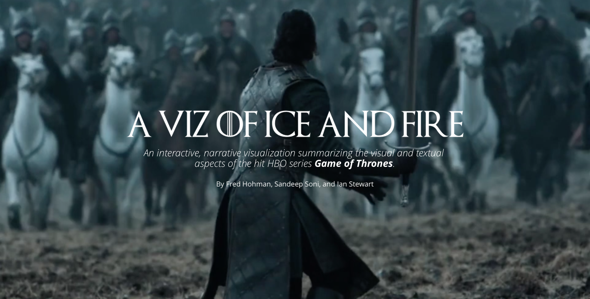

# A Viz of Ice and Fire

*An interactive, narrative visualization summarizing the visual and textual aspects of the hit HBO series Game of Thrones.*

By [Fred Hohman][fred], [Ian Stewert][ian], and [Sandeep Soni][sandeep]

This is the public repo for our CS 7450 Information Visualization final project, titled "A Viz of Ice and Fire." You can view the web visualization [here](http://fredhohman.com/a-viz-of-ice-and-fire/).

## Directory Structure
`vis/`: The web visualization, including Javascript scripts and the raw data.

`scripts/`: The Python scripts used to generate, process, and reorganize the color and text data into a usable format.

`data/`: Extra data that didn't make it into the final visualization.

[fred]: http://fredhohman.com
[ian]: http://ianbstewart.github.io/
[sandeep]: http://sandeepsoni.github.io